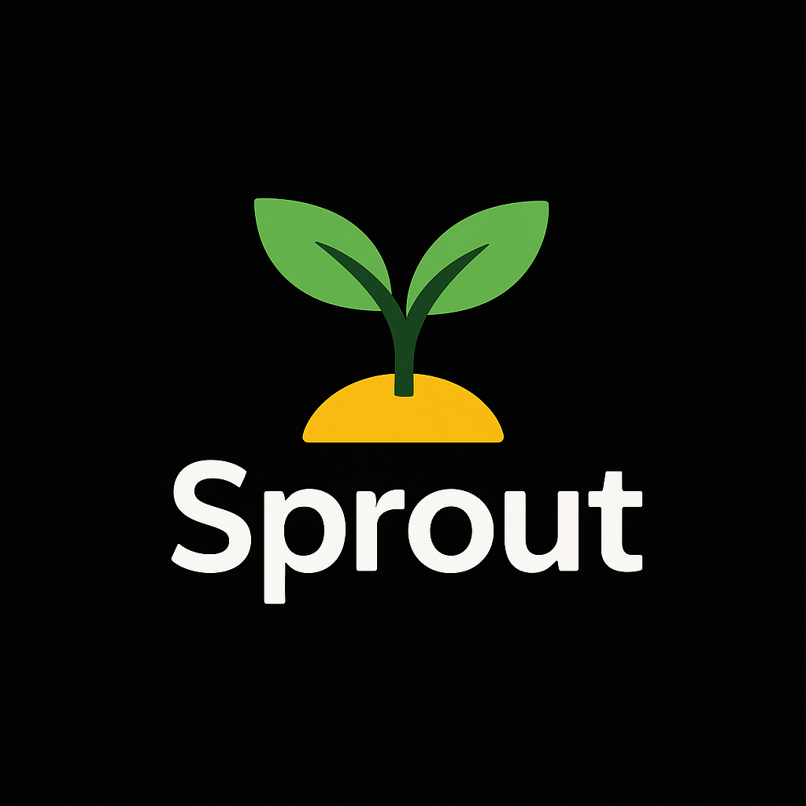

# 🌱 Sprout Budget Tracker

> Sprout Budget Tracker helps you stay mindful of your daily spending through simple manual tracking and clear visual insights. By focusing on intentional daily input rather than automated syncing, Sprout builds lasting financial awareness without unnecessary complexity.

[](https://go.mysprout.app/)
[](#tech-stack)



**The Challenge:** Traditional budget apps overwhelm users with complex monthly tracking, leading to abandonment. Sprout solves this by focusing on simple daily limits with immediate visual feedback—making financial discipline achievable and rewarding.

## 📋 Project Overview

Sprout Budget Tracker is a full-stack budgeting app that makes daily expense tracking simple and stress free. It's powered by a fast Flask API with PostgreSQL for data storage and a lightweight vanilla JavaScript frontend that keeps the experience clean and intuitive.

**Key Highlights:**
- ✅ **Production Deployed** - Live at [go.mysprout.app](https://go.mysprout.app/) on Render
- ✅ **Full Authentication System** - Secure user registration, login, and password reset with email verification
- ✅ **Comprehensive Testing** - Full test suite with pytest covering all major features
- ✅ **Performance Optimized** - Database indexing and query optimization for scalability
- ✅ **Modern DevOps** - Docker containerization, Nginx reverse proxy, and cloud deployment

This project showcases my ability to architect, develop, test, and deploy a complete web application independently—demonstrating skills in backend development, database design, frontend engineering, and DevOps practices.

## ✨ Features

- **Sets/tracks daily spending limit** with plant growth visualization
- **Sets/tracks daily spending limit** for specific expense categories
- **Add Expenses** with amount, descriptions, and specific categories
- **Create custom made expense categories** based on your needs
- **Set a daily rollover overflow** if you do not go over your daily budget
- **View history and statistics** of past expenses
- **Filter past expenses** based on category and time of expense
- **View long term spending** via weekly/monthly/yearly spending
- **View different visual graphs/charts** for spending patterns

## 🛠️ Tech Stack

### Backend
- **Python 3.x** - Core backend language
- **Flask** - Lightweight web framework with blueprint architecture
- **PostgreSQL** - Production-ready relational database
- **Gunicorn** - Production WSGI HTTP server
- **SQLAlchemy** - Database ORM for data modeling

### Frontend
- **HTML5/CSS3** - Modern web standards with responsive design
- **Vanilla JavaScript** - No framework dependencies, demonstrating core JS skills
- **Responsive Design** - Mobile-first approach with dark mode support

### DevOps & Infrastructure
- **Docker** - Containerization for consistent deployments
- **Nginx** - Reverse proxy and static file serving in production
- **Render** - Cloud deployment platform
- **Git** - Version control

### Testing & Quality
- **pytest** - Comprehensive test suite
- **PostgreSQL Indexing** - Performance optimization

## 🏗️ Architecture & Technical Highlights

### System Architecture
- **RESTful API Design** - Clean separation between frontend and backend with well-defined endpoints
- **Blueprint Architecture** - Modular Flask structure (auth, expenses, categories, preferences) for maintainability
- **Database Schema** - Normalized PostgreSQL schema with proper relationships and constraints
- **Session Management** - Secure session handling with configurable timeouts
- **Error Handling** - Comprehensive error handling with custom exception classes

### Performance & Scalability
- **Database Indexing** - Strategic indexes on frequently queried columns for optimal performance
- **Query Optimization** - Efficient database queries to minimize response times
- **Static Asset Serving** - Nginx serves static files directly for better performance
- **Production WSGI** - Gunicorn with multiple workers for concurrent request handling

### Security Best Practices
- **Password Hashing** - Secure password storage using industry-standard hashing
- **Security Headers** - Production security headers (CSP, XSS protection, etc.)
- **Session Security** - Secure session cookies with proper configuration
- **Input Validation** - Server-side validation for all user inputs
- **SQL Injection Prevention** - Parameterized queries and ORM usage

### Development Practices
- **Comprehensive Testing** - Full test suite covering authentication, expenses, categories, and preferences
- **Environment Configuration** - Separate development and production configurations
- **Docker Containerization** - Consistent deployment across environments
- **Code Organization** - Clean separation of concerns with utility functions and service layers

## 🚀 Getting Started

### Prerequisites
- Python 3.x
- PostgreSQL

### Setup

1. **Clone and install dependencies**
   ```bash
   git clone https://github.com/yourusername/sprout-budget-tracker.git
   cd sprout-budget-tracker
   cd backend
   python3 -m venv venv
   source venv/bin/activate
   pip install -r requirements.txt  # Installs Flask and all dependencies
   ```

2. **Configure database**
   
   Create `.env` in `backend/`:
   ```bash
   DATABASE_URL=postgresql://localhost/sprout_budget
   FLASK_ENV=development
   ```

3. **Run**
   ```bash
   # From project root
   ./start.sh
   ```
   
   Access at http://localhost:8080

For detailed setup, see [POSTGRESQL_SETUP.md](backend/POSTGRESQL_SETUP.md) and [DEPLOYMENT.md](DEPLOYMENT.md).

## 🧪 Testing

Comprehensive test suite using pytest covering authentication, expenses, categories, and preferences.

```bash
cd backend && source venv/bin/activate && pytest
```

## 🚀 Deployment

Sprout is deployed and live at **[go.mysprout.app](https://go.mysprout.app/)** on Render.

The application is containerized with Docker and uses:
- **Nginx** as reverse proxy and static file server
- **Gunicorn** as production WSGI server
- **PostgreSQL** for data storage

For detailed deployment instructions, see [DEPLOYMENT.md](DEPLOYMENT.md).

## 📝 About

This is a portfolio project demonstrating full-stack web development skills including backend API design, database architecture, frontend development, and cloud deployment.

Built with attention to code quality, testing, and production best practices.
